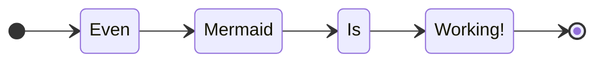

# Current Working Features
  
- [x] External Link

[https://obsidian.md/](https://obsidian.md/)

- [x] Link to local File

[test file 1 link](/file1)


- [x] File link Embed

[[file1]]

- [x] Inline Local Image


- [x] Inline Local Image Embed

![[img.png]]

- [x] Inline Remote Image


- [x] Codeblock with Language Sintax

```typescript
type StringFn: () => string
const test: StringFn = () => 'Testing Sintax, this is working...';
```

- [x] Tables

|A|B|
|-|-|
|1|2|

- [x] Mermaid Diagram



- [x] Custom Css Snippets
# Css Snippet

- [x] Theme

- [x] Callout

> [!tip] Callout
> Callout Contents

- [x] Callout Icon

>[!example] Test
>this is another callout

- [x] Callout in Embedded File

![[Callouts]]

- [x] Embedded File

![[file1]]

