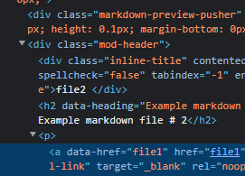

# Example markdown file

  
- [x] external link
[https://obsidian.md/](https://obsidian.md/)

- [x] internal
[test file 1 link](/file1)

- [x] reference
[[file1]]

- [x] Inline Local Image


- [x] Inline Local Image Embed
![[img.png]]

- [x] Inline Remote Image

- [x] Codeblock with Language Sintax
```javascript
const test = () => 'Testing Sintax, this is working...';
```
- [x] Mermaid Diagram


- [x] Embedded File
- [ ] TODO: Fix Embedded File Link 
![[file1]]